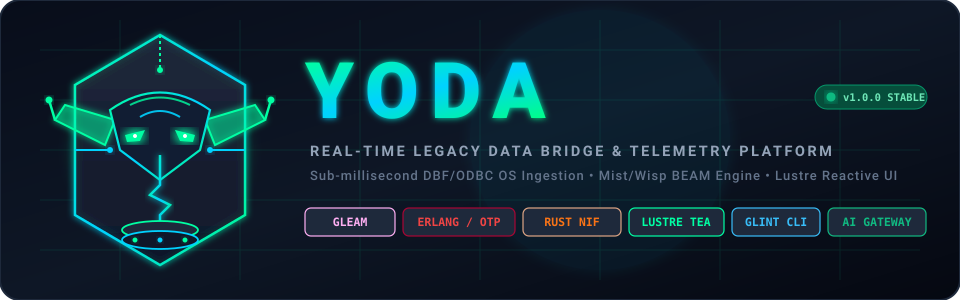

<div align="center">



# YODA (v1.0.0)

**High-Performance Real-Time Legacy Data Bridge & Telemetry Platform**

[](https://gleam.run/)
[](https://www.erlang.org/)
[](https://www.rust-lang.org/)
[](https://hexdocs.pm/lustre/)
[](LICENSE)
[](Dockerfile)

<p align="center">
  <b>Sub-millisecond DBF/ODBC Ingestion</b> • <b>Fault-Tolerant BEAM Server</b> • <b>Lustre Reactive Dashboard</b> • <b>Real-Time Anomaly Detection</b> • <b>Glint Admin CLI</b>
</p>

</div>

---

## 📑 Table of Contents
- [1. Executive Overview](#1-executive-overview)
- [2. System Architecture](#2-system-architecture)
- [3. Core Subsystems](#3-core-subsystems)
  - [I. Native Rust Ingestion (`core_bridge`)](#i-native-rust-ingestion-core_bridge)
  - [II. BEAM Concurrency & Streaming Server (`server`)](#ii-beam-concurrency--streaming-server-server)
  - [III. Lustre Reactive Dashboard (`client`)](#iii-lustre-reactive-dashboard-client)
  - [IV. Glint Administrative CLI (`cli`)](#iv-glint-administrative-cli-cli)
- [4. Enterprise Features & Capabilities](#4-enterprise-features--capabilities)
- [5. Installation & Prerequisites](#5-installation--prerequisites)
- [6. Step-by-Step Tutorials & Manuals](#6-step-by-step-tutorials--manuals)
  - [Tutorial 1: Quickstart & Initial Launch](#tutorial-1-quickstart--initial-launch)
  - [Tutorial 2: Streaming Legacy dBase (`.dbf`) Files](#tutorial-2-streaming-legacy-dbase-dbf-files)
  - [Tutorial 3: Integrating ODBC Relational Databases](#tutorial-3-integrating-odbc-relational-databases)
  - [Tutorial 4: Live Dashboard Monitoring & CSV Export](#tutorial-4-live-dashboard-monitoring--csv-export)
  - [Tutorial 5: Server Administration via Yoda CLI](#tutorial-5-server-administration-via-yoda-cli)
  - [Tutorial 6: Anomaly Webhook Alerts & AI Insights](#tutorial-6-anomaly-webhook-alerts--ai-insights)
- [7. Complete API & Protocol Reference](#7-complete-api--protocol-reference)
  - [REST API Endpoints](#rest-api-endpoints)
  - [WebSocket Streaming Protocol](#websocket-streaming-protocol)
  - [UDP Multicast Datagram Protocol](#udp-multicast-datagram-protocol)
  - [CLI Command Matrix](#cli-command-matrix)
- [8. Configuration & Environment Variables](#8-configuration--environment-variables)
- [9. Reliability, Safety & Performance](#9-reliability-safety--performance)
- [10. License & Contributing](#10-license--contributing)

---

## 1. Executive Overview

**Yoda** is a distributed, high-performance data bridge designed to solve a ubiquitous enterprise modernization bottleneck: **extracting real-time streaming telemetry and event streams out of legacy databases (e.g., FoxPro/dBase `.dbf` files, legacy ODBC systems) without intrusive application rewrites or database migrations.**

By uniting three premier technological foundations:
1. **Low-Level Native Systems (Rust + Rustler NIFs):** Direct OS file-descriptor notifications (`notify`), binary dBase record extraction (`dbase`), and connection-pooled ODBC handles (`odbc-api`).
2. **Fault-Tolerant Actor Concurrency (Gleam + Erlang/OTP):** Non-blocking HTTP and WebSockets via `mist` & `wisp`, atomic ETS sliding-window rate limiting, and automated `gen_server` log rotation.
3. **Pure Type-Safe Reactive UI (Lustre + Web Components):** The Elm Architecture (TEA) in Gleam with hardware-accelerated Canvas line charts, anomaly toasts, and glassmorphism styling.

Yoda delivers sub-millisecond data distribution, automated anomaly detection, webhook notifications, and AI analysis in a unified ecosystem.

---

## 2. System Architecture

```
                                  ┌───────────────────────────┐
                                  │      LEGACY SOURCES       │
                                  │  • FoxPro/dBase (.dbf)    │
                                  │  • ODBC RDBMS (SQL/ISAM)  │
                                  └─────────────┬─────────────┘
                                                │
                                OS File Events  │ ODBC Handles
                                (notify crate)  │ (odbc-api crate)
                                                ▼
┌───────────────────────────────────────────────────────────────────────────────────────────────┐
│                           CORE BRIDGE (Rust NIF / vella_nif)                                  │
│   • Asynchronous OS Watcher Thread        • Binary dBase Parser & Serialization               │
│   • Safe ResourceArc ODBC Connection Pool • High-Frequency UDP Multicaster (HFT Stream)       │
└───────────────────────────────────────────────┬───────────────────────────────────────────────┘
                                                │
                                 Rustler FFI    │ UDP Socket
                                 (vella_ffi)    │
                                                ▼
┌───────────────────────────────────────────────────────────────────────────────────────────────┐
│                                YODA SERVER (Gleam & Erlang/OTP)                               │
│                                                                                               │
│   ┌──────────────────────────────────┐            ┌──────────────────────────────────────┐    │
│   │       MIST & WISP ENGINE         │            │           OTP ACTOR SYSTEM           │    │
│   │ • HTTP/1.1 REST Endpoints        │            │ • ETS Lock-Free Rate Limiter (60s)   │    │
│   │ • Token-Authenticated WebSocket  │            │ • ETS Active Users Atomic Counter    │    │
│   │ • Anomaly Detector (Val > 80)    │            │ • GenServer Log Rotator (>500KB)     │    │
│   │ • OpenAI AI Gateway Proxy        │            │ • Async Webhook Dispatcher Worker    │    │
│   └─────────────────┬────────────────┘            └──────────────────────────────────────┘    │
└─────────────────────┼────────────────────────────────────────────────────────┬────────────────┘
                      │                                                        │
                      │ WebSocket (/ws?token=...)                              │ HTTP REST
                      │ JSON / Telemetry Frames                                │ (inets / cli_ffi)
                      ▼                                                        ▼
┌──────────────────────────────────────────────┐        ┌──────────────────────────────────────┐
│           CLIENT (Lustre SPA)                │        │               YODA CLI               │
│                                              │        │                                      │
│ • Model-View-Update (TEA) State Machine      │        │ • Status & Server Health Check       │
│ • Canvas <live-data-chart> (50-pt buffer)    │        │ • Live Memory & CPU Inspector (top)  │
│ • Reactive <complex-data-grid> Grid          │        │ • Past Anomalies Query Engine        │
│ • Ephemeral AI Insight Interface             │        │ • IP Unban & Rate Limiter Reset      │
│ • Native CSS View Transitions & Glassmorphism│        │ • Webhook Diagnostic Dispatcher      │
└──────────────────────────────────────────────┘        │ • Instant Log Rotation Trigger       │
                                                        └──────────────────────────────────────┘
```

---

## 3. Core Subsystems

### I. Native Rust Ingestion (`core_bridge`)
* **Path:** `core_bridge/native/vella_nif/src/lib.rs` & `core_bridge/src/vella_ffi.gleam`
* **Technology:** Rust 2021, `rustler 0.29.0`, `notify 6.1`, `dbase 0.3`, `odbc-api 0.51`.
* **Zero-Copy Ingestion:** Watches files at the OS kernel level. On byte change, records are read directly from binary format into memory and dispatched via UDP sockets to avoid garbage collection pressure on high-throughput bursts.
* **ODBC Resource Management:** Wraps ODBC connections inside Rustler's `ResourceArc<OdbcConnectionResource>`, allowing BEAM to manage the lifetime of external C/ODBC pointers safely.

### II. BEAM Concurrency & Streaming Server (`server`)
* **Path:** `server/src/server.gleam` and supporting Erlang modules.
* **Technology:** Gleam 1.4, `mist 6.0`, `wisp 2.2`, Erlang/OTP ETS, `gen_server`.
* **Lock-Free Rate Limiting:** High-concurrency sliding-window IP limiter backed by Erlang ETS (`rate_limiter.erl`).
* **Active User Tracking:** Thread-safe connection count tracked in ETS table `active_users_table`.
* **Automatic Log Archiving:** Background `gen_server` (`log_rotator.erl`) continuously samples `data_history.log` and archives it when the file size exceeds 512,000 bytes.
* **Asynchronous Webhooks:** Detached Erlang processes (`webhook_helper.erl`) execute outbound POST alerts without stalling WebSocket packet handling.

### III. Lustre Reactive Dashboard (`client`)
* **Path:** `client/src/client.gleam`, `client/src/ui/`
* **Technology:** Gleam, Lustre 5.7, Vite, HTML5 Canvas Web Components.
* **Architecture:** The Elm Architecture (TEA) handles message dispatching, WebSocket lifecycle events, and theme toggling.
* **Web Components:**
  - `<live-data-chart>`: Canvas-based 60 FPS rolling line chart with real-time anomaly threshold highlighting (`> 80`) and one-click CSV export.
  - `<complex-data-grid>`: Real-time tabular data viewer with conditional alert styling.
  - `<custom-calendar>`: AI insight event viewer.

### IV. Glint Administrative CLI (`cli`)
* **Path:** `cli/src/cli.gleam`, `cli/src/cli_ffi.erl`
* **Technology:** Gleam, Glint 1.3, Erlang `httpc`.
* **Purpose:** Command-line terminal management interface for sysadmins and operators to inspect BEAM metrics, query anomalies, clear IP rate-limit blocks, and trigger manual log rotations.

---

## 4. Enterprise Features & Capabilities

- [x] **Sub-Millisecond File Change Ingestion:** Kernel-level OS notifications via `notify` eliminate polling lag.
- [x] **Native dBase & FoxPro Parsing:** Direct binary `.dbf` decoding via pure Rust.
- [x] **Token-Protected WebSocket Streaming:** Handshake authentication with query tokens (`/ws?token=...`).
- [x] **Automated Anomaly Detection Engine:** Ingested values exceeding `80` immediately trigger visual alerts and asynchronous webhook payloads.
- [x] **High-Concurrency ETS Rate Limiter:** Protects endpoints against denial-of-service with lock-free atomic counters.
- [x] **Background Log Rotation GenServer:** Automatically archives logs exceeding 500 KB to prevent disk exhaustion.
- [x] **Hardware-Accelerated Web Dashboard:** 60 FPS Canvas rendering, glassmorphism aesthetics, and instant CSV export.
- [x] **OpenAI AI Gateway Integration:** Proxies prompt payloads to OpenAI's Chat Completions endpoint for automated telemetry reasoning.
- [x] **Full-Featured Operator CLI:** Type-safe Glint CLI providing remote management.
- [x] **Container-Ready:** Ships with multi-stage Dockerfile and Docker Compose orchestration.

---

## 5. Installation & Prerequisites

### Prerequisites
1. **Erlang/OTP:** 26.0 or higher (`erl -version`)
2. **Gleam:** 1.4.0 or higher (`gleam --version`)
3. **Rust & Cargo:** 1.70.0 or higher (`cargo --version`)
4. **Node.js & npm:** 18.0.0 or higher (for the client web application)
5. **ODBC Driver (Optional):** Required only if connecting to live ODBC database backends.

---

## 6. Step-by-Step Tutorials & Manuals

### Tutorial 1: Quickstart & Initial Launch

#### Option A: Running with Docker Compose (Recommended)

To start the Yoda backend server in a container:
```bash
# Clone the repository
git clone https://github.com/CharleGutierrez/yoda.git
cd yoda

# Launch the server container
docker compose up --build
```
The server will boot on `http://localhost:8000`.

---

#### Option B: Running from Source

1. **Build the Native Rust Bridge:**
   ```bash
   cd core_bridge/native/vella_nif
   cargo build --release
   cd ../..
   ```

2. **Start the Yoda Server:**
   ```bash
   cd server
   export PORT=8000
   export WS_TOKEN="yoda-secret"
   export AI_GATEWAY_KEY="your-openai-api-key"
   gleam run
   ```

3. **Start the Lustre Web Dashboard:**
   ```bash
   # Open a new terminal
   cd client
   npm install
   npm run dev
   ```
   Open your browser at `http://localhost:3000`.

4. **Test the CLI:**
   ```bash
   # Open a new terminal
   cd cli
   gleam run status
   ```

---

### Tutorial 2: Streaming Legacy dBase (`.dbf`) Files

Yoda can monitor any local `.dbf` database file and stream every appended or updated row in real time:

1. Place your target `.dbf` file in the working directory (e.g., `data.dbf`).
2. When the WebSocket client connects with the `"start"` frame, Yoda initiates the OS watcher:
   ```gleam
   // Triggered automatically via legacy_bridge
   vella_ffi.watch_legacy_dbf("data.dbf")
   ```
3. Whenever an external legacy process writes to `data.dbf`, the native Rust layer parses the binary records and multicasts the data over UDP (`127.0.0.1:8080`) while streaming the event down the active WebSocket connection.

---

### Tutorial 3: Integrating ODBC Relational Databases

To connect Yoda to an existing ODBC database (SQL Server, Oracle, PostgreSQL, FoxPro ODBC):

1. Configure your ODBC connection string (e.g., `"Driver={PostgreSQL UNICODE};Server=localhost;Port=5432;Database=legacy_db;"`).
2. Invoke the ODBC bridge:
   ```gleam
   import vella_ffi

   let connection_res = vella_ffi.connect_legacy_odbc("DSN=MyLegacySource;Uid=user;Pwd=secret;")
   ```
3. Yoda creates an atomic, thread-safe connection resource managed safely by the BEAM garbage collector.

---

### Tutorial 4: Live Dashboard Monitoring & CSV Export

1. Open `http://localhost:3000` in any modern web browser.
2. **Header Controls:**
   - **Toggle Theme:** Shifts between high-contrast dark cyberpunk mode and light mode.
   - **Status Indicator:** Shows live WebSocket connection state (`Vella HFT Sync Active`).
3. **Live Data Chart:**
   - Visualizes live streaming values on a 50-point rolling Canvas chart.
   - Values exceeding threshold `80` render in bright red with an instant floating toast alert.
   - Click **Export Data** to download the active telemetry history as `yoda_data_export.csv`.
4. **Data Grid:**
   - Inspects real-time structured telemetry records with automatic cell highlighting.

---

### Tutorial 5: Server Administration via Yoda CLI

The `cli` binary provides an operator control center:

```bash
# Navigate to the CLI directory
cd cli

# Check server status and uptime
gleam run status

# Inspect live BEAM memory and CPU time
gleam run top

# List recent anomalous events (> 80)
gleam run anomalies

# Unban a client IP address blocked by the rate limiter
gleam run unban 192.168.1.50

# Dispatch a test webhook to verify alert integration
gleam run test-webhook https://webhook.site/your-id

# Force immediate manual log rotation and archiving
gleam run archive
```

---

### Tutorial 6: Anomaly Webhook Alerts & AI Insights

#### 1. Configuring Real-Time Webhooks
Set the `WEBHOOK_URL` environment variable prior to starting the server:
```bash
export WEBHOOK_URL="https://alerts.yourcompany.com/webhook/yoda"
```
When an anomaly (`value > 80`) is encountered, the server asynchronously dispatches a JSON payload:
```json
{
  "alert": "Anomaly detected",
  "message": "Update: {\"value\": 94.2}"
}
```

#### 2. Using the AI Insights Gateway
Set the `AI_GATEWAY_KEY` environment variable:
```bash
export AI_GATEWAY_KEY="sk-..."
```
In the web dashboard, enter a question in the **Autonomous AI Insights** panel (e.g., *"Analyze recent anomalous spikes"*). Yoda will route the prompt to the OpenAI Chat Completions API and dynamically display the model's analytical response.

---

## 7. Complete API & Protocol Reference

### REST API Endpoints

| Method | Endpoint | Description | Request Body | Response Format |
|---|---|---|---|---|
| `GET` | `/api/status` | Server health and uptime in seconds | None | `{"status":"healthy","uptime":128}` |
| `GET` | `/metrics` | Prometheus metrics gauge | None | `# HELP yoda_uptime Server uptime\nyoda_uptime 128` |
| `GET` | `/api/system_resources` | Total BEAM memory and CPU runtime | None | `{"memory": 45219800, "cpu": 1240}` |
| `GET` | `/api/history` | Last 50 entries from `data_history.log` | None | `["Update: 45.2", "Update: 78.1", ...]` |
| `GET` | `/api/anomalies` | Last 100 entries filtered by `value > 80` | None | `["Update: 89.4", "Update: 99.1", ...]` |
| `GET` | `/api/active_users` | Count of active WebSocket connections | None | `{"active_users": 4}` |
| `POST` | `/api/unban` | Resets rate limit counter for an IP | `text/plain` (e.g. `127.0.0.1`) | `{"status":"unbanned"}` |
| `POST` | `/api/test_webhook` | Triggers a test anomaly webhook | `text/plain` (Webhook URL) | `{"status":"dispatched"}` |
| `POST` | `/api/archive` | Forces log file rotation | None | `{"status":"archived"}` |
| `POST` | `/api/ai_insights` | OpenAI Chat Completions proxy | JSON Chat Payload | JSON Chat Completion Response |

---

### WebSocket Streaming Protocol

* **Endpoint:** `ws://localhost:8000/ws?token=<WS_TOKEN>`
* **Authentication:** Query parameter `token` must match server environment variable `WS_TOKEN`.
* **Client Handshake Frame:**
  ```text
  start
  ```
  *Initiates legacy DBF file monitoring and streams confirmation.*
* **Client Telemetry Frames:**
  ```text
  {"sensor": "press_01", "value": 88.5}
  ```
* **Server Broadcast Frames:**
  ```text
  Update: {"sensor": "press_01", "value": 88.5}
  ```

---

### UDP Multicast Datagram Protocol

* **Default Multicast Target:** `127.0.0.1:8080` (configured via `HFT_DEST_IP`).
* **Packet Payload Formats:**
  ```text
  DBF_DATA: Record { id: 1042, amount: 450.00, status: "POSTED" }
  HFT Broadcast to topic legacy_sync: data.dbf (watching)
  ```

---

### CLI Command Matrix

```
yoda [COMMAND] [ARGUMENTS...]

Commands:
  status                     Pings the server status and uptime
  version                    Prints CLI version information
  top                        Shows live BEAM memory and CPU statistics
  anomalies                  Fetches and displays past anomalous entries
  unban <ip>                 Resets the rate limiter for a blocked IP address
  test-webhook <url>         Dispatches a test anomaly webhook payload
  archive                    Forces server-side log rotation and archiving
```

---

## 8. Configuration & Environment Variables

| Variable | Type | Default | Description |
|---|---|---|---|
| `PORT` | `Integer` | `8000` | HTTP and WebSocket listening port for Mist |
| `WS_TOKEN` | `String` | — | Required query token for WebSocket authentication |
| `AI_GATEWAY_KEY` | `String` | `default_key` | OpenAI API Bearer key for AI Insights proxy |
| `WEBHOOK_URL` | `String` | — | Target URL for asynchronous anomaly POST webhooks |
| `HFT_BIND_IP` | `String` | `0.0.0.0:0` | Local UDP socket bind address in Rust NIF |
| `HFT_DEST_IP` | `String` | `127.0.0.1:8080` | UDP multicast destination for HFT stream |

---

## 9. Reliability, Safety & Performance

```
┌─────────────────────────┬────────────────────────────────────────────────────────┐
│ Property                │ Guarantee & Implementation Strategy                   │
├─────────────────────────┼────────────────────────────────────────────────────────┤
│ Type Safety             │ 100% compile-time type checked via Gleam.              │
│ Memory Safety           │ Rustler ResourceArc wraps raw C/ODBC pointers safely. │
│ DoS Protection          │ Lock-free atomic ETS rate limiting (100 req/60s).      │
│ Non-Blocking I/O        │ Mist non-blocking socket loops and async webhooks.     │
│ Storage Self-Healing    │ GenServer log rotator bounds disk usage to 500 KB.     │
│ UI Smoothness           │ Dedicated Canvas context rendering at 60 FPS.          │
└─────────────────────────┴────────────────────────────────────────────────────────┘
```

---

## 10. License & Contributing

Project Yoda is open-source software licensed under the [Apache-2.0 License](LICENSE).

### Contributing
1. Fork the repository on GitHub (`https://github.com/CharleGutierrez/yoda`).
2. Create your feature branch (`git checkout -b feature/awesome-feature`).
3. Format and verify code:
   ```bash
   gleam format
   cargo fmt --all
   gleam test
   ```
4. Commit your changes (`git commit -m 'feat: add awesome feature'`).
5. Push to the branch (`git push origin feature/awesome-feature`).
6. Open a Pull Request.

---

<div align="center">
  <sub>Engineered with ❤️ using Gleam, Erlang/OTP, Rust, and Lustre.</sub>
</div>
